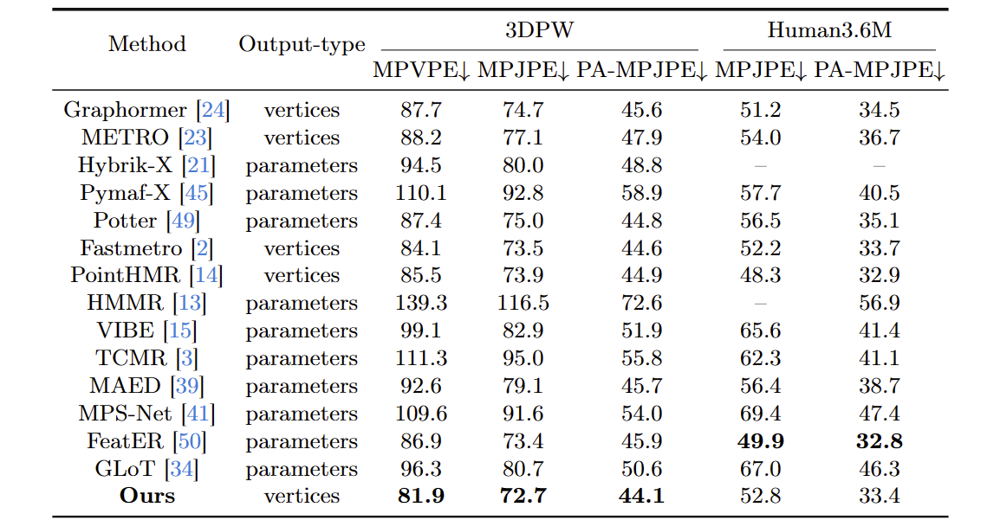

# RemoCap: Disentangled Representation Learning for Motion Capture

# Introduction

This is the official code repository [Code](https://github.com/STDFormer-3D-Human-Mesh-Recovery/RemoCap) for the Pytorch
implementation of RemoCap More details in [Project page](https://stdformer-3d-human-mesh-recovery.github.io/STDFormer/)

# Abstract


Reconstructing 3D human bodies from realistic motion sequences remains a challenge due to pervasive and complex
occlusions. Current methods struggle to capture the dynamics of occluded body parts, leading to model penetration and
distorted motion. RemoCap leverages Spatial Disentanglement (SD) and Motion Disentanglement (MD) to overcome these
limitations. SD addresses occlusion interference between the target human body and surrounding objects. It achieves this
by disentangling target features along the dimension axis. By aligning features based on their spatial positions in each
dimension, SD isolates the target object's response within a global window, enabling accurate capture despite
occlusions. The MD module employs a channel-wise temporal shuffling strategy to simulate diverse scene dynamics. This
process effectively disentangles motion features, allowing RemoCap to reconstruct occluded parts with greater fidelity.
Furthermore, this paper introduces a sequence velocity loss that promotes temporal coherence. This loss constrains
inter-frame velocity errors, ensuring the predicted motion exhibits realistic consistency. Extensive comparisons with
state-of-the-art (SOTA) methods on benchmark datasets demonstrate RemoCap's superior performance in 3D human body
reconstruction. On the 3DPW dataset, RemoCap surpasses all competitors, achieving the best results in MPVPE (81.9),
MPJPE (72.7), and PA-MPJPE (44.1) metrics. Codes are available in the appendix.

# Result


The figure show the performance of our model in a sequential video task, showing the stability of the reconstruction
results, the stability against occlusion interference and the advantages of limb position alignment.

Here we report the performance of RemoCap.



Here are the results of our reconstruction comparing the current SOTA
methods [GloT](https://stdformer-3d-human-mesh-recovery.github.io/STDFormer/).


# Running STDFormer

The base codes are largely borrowed from [FasterMETRO](https://github.com/postech-ami/FastMETRO)
and [PointHMR](https://github.com/sxl142/GLoT).

## Installation

```bash
# We suggest to create a new conda environment with python version 3.8
conda create --name STDF python=3.8

# Activate conda environment
conda activate STDF

# Install Pytorch that is compatible with your CUDA version
# CUDA 10.1
conda install pytorch==1.7.1 torchvision==0.8.2 cudatoolkit=10.1 -c pytorch
# CUDA 10.2
conda install pytorch==1.7.1 torchvision==0.8.2 cudatoolkit=10.2 -c pytorch
# CUDA 11.1
conda install pytorch==1.8.0 torchvision==0.9.0 cudatoolkit=11.1 -c pytorch -c conda-forge

# Install apex
git clone https://github.com/NVIDIA/apex.git
cd apex
python setup.py install --cuda_ext --cpp_ext
cd ..

# Install OpenDR
pip install matplotlib
pip install git+https://gitlab.eecs.umich.edu/ngv-python-modules/opendr.git

# Install STDFormer
git clone --recursive https://github.com/STDFormer-3D-Human-Mesh-Recovery/STDFormer.git
cd STDFormer
Unzip the file STDFormer/src/model.zip
python setup.py build develop

# Install requirements
pip install -r requirements(1).txt
pip install ./manopth/.
pip install --upgrade azureml-core


```

## Dataset

Please refer to [PointHMR](https://github.com/DCVL-3D/PointHMR_release). directly for dataset download and processing.

# Experiment

## Training

### running

```bash
python /HOME/your......path/STDFormer/src/tools/run_STDFormer_bodymesh_dp_3dpw.py
```

Please download the STDFormer 3DPW Datatset weights we provide to /STDFormer/3dpw_checkpoint/state_dict.bin
[STDFormer_checkponit_3DPW](https://drive.google.com/file/d/1xiEAOaPhZyNI7M3xl3WnRJPnGF8Jn4rx/view?usp=sharing)

### change path

```bash
#You need change yourself path

def parse_args():
    parser = argparse.ArgumentParser()
    #########################################################
    # Data related arguments
    #########################################################
    parser.add_argument("--data_dir", default='datasets', type=str, required=False,
                        help="Directory with all datasets, each in one subfolder")
    parser.add_argument("--train_yaml", default='/HOME/HOME/data/PointHMR/datasets/3dpw/train.yaml', type=str, required=False,
                        help="Yaml file with all data for training.")
    parser.add_argument("--val_yaml", default='/HOME/HOME/data/PointHMR/datasets/3dpw/test_has_gender.yaml', type=str, required=False,
                        help="Yaml file with all data for validation.")
 ..........................
..............................
    #########################################################
    # Loading/Saving checkpoints
    #########################################################
    parser.add_argument("--output_dir", default='/HOME/............./output_3DPWZ_result', type=str, required=False,
                        help="The output directory to save checkpoint and test results.")
    parser.add_argument("--saving_epochs", default=1, type=int)
    parser.add_argument("--resume_checkpoint", default="/HOME/.........../STDFormer/3dpw_checkpoint/state_dict.bin", type=str, required=False,
                        help="Path to specific checkpoint for resume training.")
```

## Ablation experiment


Before the stage involving the participation of the transformer encoder and decoder in reconstruction, when extracting
features from the target, one often encounters the following situations, especially in uncertain outdoor environments:

1. Multiple individuals appearing in the frame, interacting and correlating with the target person.
2. The foreground and background in the frame are highly complex, with the foreground obscuring the target object, and
   low distinguishability between the background and the target object.
3. For video tasks, the previously mentioned scenarios may involve motion, including the movement of the target object
   and the camera's own pose. Both stationary and moving non-target objects, or strong motion, can interfere with the
   extraction of target features. Particularly in video tasks, disturbances in motion features accumulate over the
   temporal axis, resulting in increased noise.

The above three points are categorized by us as spatiotemporal feature coupling, which is the primary reason for the
inaccurate extraction of target features.

Therefore, the key to solving the feature coupling problem lies in decoupling the coupled features from both spatial and
temporal perspectives to address the three points mentioned above.

#### Spatial Disentanglement:

Spatial disentanglement refers to, within a frame, using cross-channel attention learning to supervise target features and
non-target features through different channel pooling and loss functions. After discretization, attention is
concentrated on the channel where the target features are located, thereby enhancing the learning of target features
within the frame and reducing attention to non-target features.

#### Temporal Disentanglement:

Temporal disentanglement involves forming a feature space based on sequential inputs, then learning the differences in
features on the temporal sequence level through cross-channel learning. According to the attention weights of different
channels, temporal decoupling is performed in the feature space to separate target features and non-target features on
the temporal sequence level, which includes motion-related non-target features.

## Feature work

In the future we consider being able to transfer our task to the reconstruction of the hand task, as our approach is
model-free should give good results. On the other hand, we will continue to explore the advantages of the model-free
approach over the parametric model approach in video tasks. For example, the model-free approach is able to adequately
match the silhouette features, gender, and age of the target person when reconstructing the human body.

# License

This project is licensed under the terms of the MIT license.
